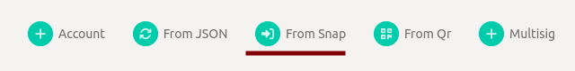
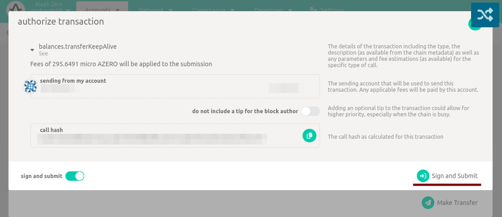
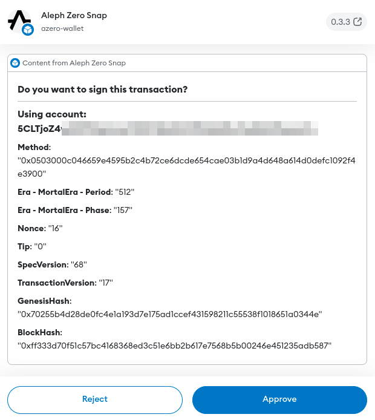

# Frequently Asked Questions

## How can I install Aleph Zero Wallet snap?

To install the snap, visit [azero-dev] website and click "From snap" button. The snap will be installed automatically,
and your default Aleph Zero Wallet account will be imported.

## How can I uninstall Aleph Zero Wallet snap?

To uninstall the snap, follow the instructions in the [official MetaMask documentation][uninstall-snap].

## How can I use the snap?

After installing the snap, you can use it to sign transactions and interact with the Aleph Zero network.
To use the snap as a signer, proceed to authorizing transaction as usual. Upon clicking the "Sign and Submit" button,
the snap will prompt you to authorize the transaction.

Below we can see transaction details view displayed by the snap prompt:

In order to sign the transaction using your snap account, click the "Approve" button.

## How can I export my account from the snap?

It's currently not possible to export your account from the snap. To learn more about current limitations, please
refer to the [snap documentation](/snap).

[azero-dev]: https://azero.dev

[uninstall-snap]: https://support.metamask.io/hc/en-us/articles/18377089629723-How-to-uninstall-a-Snap
